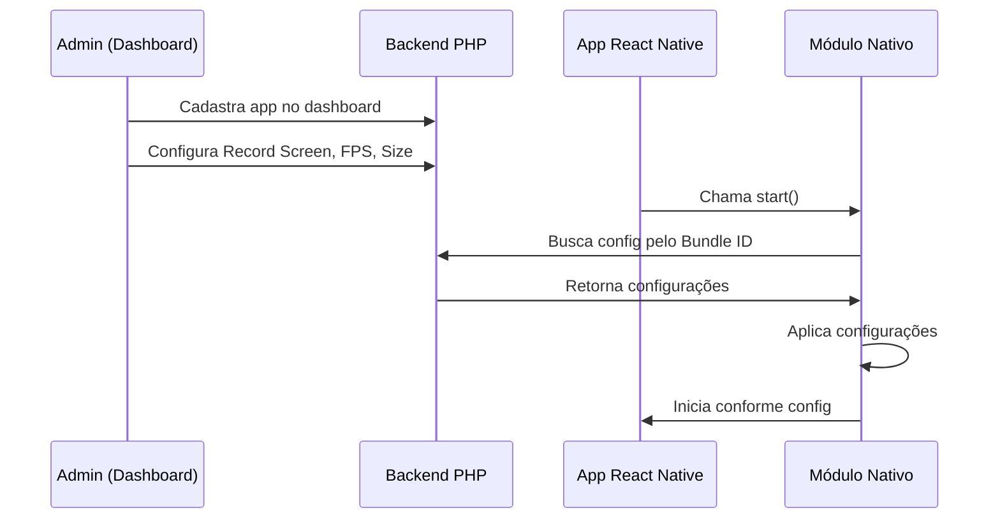

# 📱 Sistema de Gestão de Aplicativos - Expo Analytics

Este documento explica o novo sistema de gestão centralizada de aplicativos implementado no Expo Analytics, que permite controlar remotamente as configurações de cada app.

## 🎯 Visão Geral

O sistema permite:
- **Cadastrar múltiplos aplicativos** no dashboard
- **Configurar individualmente** cada app (Record Screen, Framerate, Screen Size)
- **Aplicar configurações automaticamente** nos apps sem necessidade de atualização
- **Filtrar dados** por aplicativo no dashboard

## 🔧 Como Funciona

### 1. Fluxo de Configuração



### 2. Decisões Automáticas

O módulo nativo decide automaticamente:
- **Se deve gravar**: baseado em `recordScreen: true/false`
- **Quantos FPS capturar**: baseado em `framerate: 1-30`
- **Qual resolução usar**: baseado em `screenSize: 320-960px`

## 📋 Guia Passo a Passo

### Passo 1: Cadastrar Aplicativo

1. **Acesse o dashboard**: `http://localhost:8080/dashboard`
2. **Clique** em "Novo Aplicativo"
3. **Preencha os dados**:
   - **Nome**: `Meu App de Teste`
   - **Bundle ID**: `com.empresa.meuapp` (deve ser exato)
   - **Plataforma**: `iOS` ou `Android`
4. **Clique** em "Criar Aplicativo"

### Passo 2: Configurar o App

1. **Na lista de apps**, clique no ícone ⚙️ "Configurar"
2. **Configure Record Screen**:
   - ✅ **Ativo**: App irá capturar screenshots
   - ❌ **Inativo**: App não irá capturar (economiza recursos)
3. **Se Record Screen ativo, configure**:
   - **Framerate**: 1-30 fps (recomendado: 10-15 fps)
   - **Screen Size**: 320-960px (recomendado: 480px)
4. **Salve** as configurações

### Passo 3: Usar no App React Native

O app automaticamente buscará e aplicará as configurações:

```typescript
import * as ExpoAnalytics from 'expo-analytics';

// O Bundle ID será automaticamente detectado
await ExpoAnalytics.start({
  apiHost: 'http://localhost:8080',
  userId: 'user123',
  userData: {
    appVersion: '1.0.0'
  }
});
// ✅ Configurações aplicadas automaticamente!
```

## 🎮 Interface do Dashboard

### Tela Principal - Lista de Apps

```
┌─────────────────────────────────────────────┐
│ 📱 Gestão de Aplicativos      [+ Novo App] │
├─────────────────────────────────────────────┤
│ ┌─────────────────┐ ┌─────────────────┐   │
│ │ 🍎 Meu App iOS  │ │ 🤖 Meu App Droid│   │
│ │ com.app.ios     │ │ com.app.android │   │
│ │                 │ │                 │   │
│ │ Record Screen:  │ │ Record Screen:  │   │
│ │ ✅ Ativo (15fps)│ │ ❌ Inativo      │   │
│ │ Screen: 480px   │ │                 │   │
│ │                 │ │                 │   │
│ │ [⚙️][🗑️][📊 Ver] │ │ [⚙️][🗑️][📊 Ver] │   │
│ └─────────────────┘ └─────────────────┘   │
└─────────────────────────────────────────────┘
```

### Modal de Configuração

```
┌─────────────────────────────────────────┐
│ ⚙️ Configurar Aplicativo            [❌] │
├─────────────────────────────────────────┤
│ Nome: [Meu App iOS                 ]   │
│                                        │
│ ☑️ Record Screen (Ativar gravação)     │
│                                        │
│ ┌─ Configurações de Gravação ─────────┐ │
│ │ Framerate: 15 fps [■■■■■□□□□□]      │ │
│ │                   1 fps    30 fps   │ │
│ │                                    │ │
│ │ Screen Size: [480px ▼]             │ │
│ └────────────────────────────────────┘ │
│                                        │
│              [Cancelar] [Salvar]       │
└─────────────────────────────────────────┘
```

### Dashboard Filtrado por App

```
┌─────────────────────────────────────────────┐
│ ← Voltar aos Apps    🍎 Meu App iOS  [⚙️]  │
│ com.app.ios • iOS                          │
├─────────────────────────────────────────────┤
│ [👥 50] [📹 25] [📸 1.2K] [🖱️ 342]        │
│ Usuários Sessões Screenshots Eventos      │
├─────────────────────────────────────────────┤
│ 👥 Usuários │ 👤 Dados do Usuário          │
│ • user001   │ • Selecionado: user001       │
│ • user002   │ • Último acesso: hoje 14:30  │
│ • user003   │ • Versão: 1.2.0              │
│             │ • 📹 3 sessões gravadas       │
└─────────────────────────────────────────────┘
```

## 🔧 Configurações Detalhadas

### Record Screen
- **Propósito**: Controla se o app deve capturar screenshots
- **Impacto**: 
  - ✅ **Ativo**: Captura screenshots, permite reprodução de sessões
  - ❌ **Inativo**: Apenas eventos e dados do usuário (economiza recursos)
- **Casos de uso**:
  - Desenvolvimento: Ativo para debug
  - Produção: Inativo para economia de recursos
  - A/B Test: Ativo para grupo específico

### Framerate (1-30 fps)
- **Recomendações**:
  - **5-10 fps**: Economia máxima, qualidade básica
  - **10-15 fps**: Balanceado (recomendado)
  - **20-30 fps**: Qualidade alta, mais recursos
- **Impacto**:
  - **Bateria**: Maior FPS = maior consumo
  - **Banda**: Maior FPS = mais dados para upload
  - **Armazenamento**: Maior FPS = mais espaço no servidor

### Screen Size (320-960px)
- **Opções disponíveis**: 320, 360, 375, 390, 400, 414, 480, 540, 600, 720, 768, 800, 900, 960
- **Proporção**: Sempre mantida em 1:2 (largura:altura)
- **Recomendações**:
  - **320-400px**: Para economizar banda e armazenamento
  - **480px**: Balanceado (padrão)
  - **720-960px**: Qualidade máxima para análises detalhadas

## 🚀 Casos de Uso Avançados

### 1. A/B Testing de Performance

```json
// App Versão A - Performance otimizada
{
  "bundleId": "com.app.version-a",
  "config": {
    "recordScreen": true,
    "framerate": 10,
    "screenSize": 400
  }
}

// App Versão B - Qualidade máxima
{
  "bundleId": "com.app.version-b", 
  "config": {
    "recordScreen": true,
    "framerate": 20,
    "screenSize": 720
  }
}
```

### 2. Configuração por Ambiente

```json
// Desenvolvimento - Debug completo
{
  "bundleId": "com.app.dev",
  "config": {
    "recordScreen": true,
    "framerate": 30,
    "screenSize": 960
  }
}

// Produção - Economia de recursos
{
  "bundleId": "com.app.prod",
  "config": {
    "recordScreen": false,
    "framerate": 5,
    "screenSize": 320
  }
}
```

### 3. Debug Remoto Seletivo

```typescript
// No app, você pode forçar configurações para debug
await ExpoAnalytics.start({
  apiHost: 'http://localhost:8080',
  userId: 'dev-user-123',
  // Override para debug (sempre grava)
  framerate: 30,
  screenSize: 960,
  userData: {
    debugMode: true
  }
});
```

## 📊 Monitoramento e Logs

### Logs do App (iOS)
```
📱 [ExpoAnalytics] Bundle ID: com.empresa.meuapp
🔍 [ExpoAnalytics] Buscando configurações para: com.empresa.meuapp
📡 [ExpoAnalytics] Config response status: 200
✅ [ExpoAnalytics] Configurações recebidas: {
    "recordScreen": true,
    "framerate": 15,
    "screenSize": 480
}
🔧 [ExpoAnalytics] Configurações aplicadas:
   Record Screen: true
   Framerate: 15 fps
   Screen Size: 480x960
🎬 [ExpoAnalytics] Captura de tela iniciada com 15 fps
```

### Logs do Servidor (PHP)
```
[2024-01-15 14:30:22] GET /app-config?bundleId=com.empresa.meuapp - 45 bytes
[2024-01-15 14:30:22] App created: com.empresa.meuapp
[2024-01-15 14:30:25] Config requested for app: com.empresa.meuapp
```

## 🔒 Segurança e Validação

### Bundle ID
- **Validação**: Deve seguir formato `com.empresa.app`
- **Unicidade**: Cada Bundle ID é único no sistema
- **Correspondência**: Deve ser exato entre app e dashboard

### Configurações Seguras
- **Framerate**: Limitado a 1-30 fps (previne sobrecarga)
- **Screen Size**: Limitado a tamanhos predefinidos
- **Record Screen**: Boolean simples (true/false)

### Fallback Automático
Se o servidor não responder ou houver erro:
```json
// Configurações padrão aplicadas
{
  "recordScreen": false,
  "framerate": 10,
  "screenSize": 480
}
```

## 🎯 Próximos Passos

1. **Use o sistema**: Cadastre seus apps e teste as configurações
2. **Monitore performance**: Observe o impacto das diferentes configurações
3. **Ajuste conforme necessário**: Use o dashboard para otimizar
4. **Explore dados**: Analise as sessões gravadas por app

---

**Sistema de gestão implementado com sucesso! 🎉**

Agora você tem controle total sobre a coleta de dados de cada aplicativo, podendo otimizar performance e qualidade conforme suas necessidades específicas. 